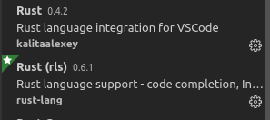
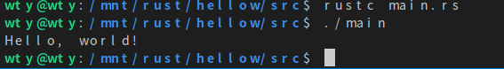

# 编程环境搭建指北

1.安装

https://www.rust-lang.org/zh-CN/tools/install

2.换源

设置环境变量 RUSTUP_DIST_SERVER(用于更新 toolchain)
```
export RUSTUP_DIST_SERVER="https://mirrors.ustc.edu.cn/rust-static"
```
RUSTUP_UPDATE_ROOT(用于更新 rustup)
```
export RUSTUP_UPDATE_ROOT="https://mirrors.ustc.edu.cn/rust-static/rustup"
```

3.下载nightly版本
```
rustup install nightly
```
切换到nightly
```
rustup default nightly
```
４．下载racer
```
cargo install racer（必须nightly版本，否则会出错）
```
5.安装rls
```
rustup update(更新rust)
```
```
rustup component add rls-preview rust-analysis rust-src
```
6.下载vscode以及插件



7.hellow world(注意1.里面的官方链接里面有完整的例子，重点是项目管理工具cargo)




